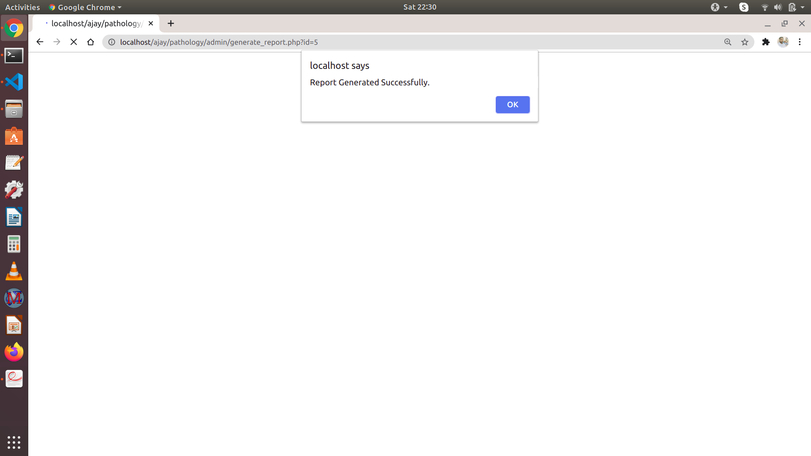

# Objective
# this unix code soln  here 
 The application That I have made Pathology Software. My Objective was To Make This Application Generate reports for patients. The Features That I have Give Admin login, Add Patient in Add patient I have generated a unique Id for each patient. Manage Patients, Generate Reports, *user Side: On the user Side, the User can log in With report Id and mobile no, and there the user can able to see the status of the report either it is pending or successful. from their success report, users can print.

# Technologies Used
* Frontend: HTML, CSS, Boostrap 4,javascript
* Backend: PHP,
# DATABASE DESIGN

# viedo of working features 

# snapshots
welcome Page

Admin button

login page

login form

Dashboard page

patient Register

Add New Patient form

patient Added successfully message

Mangage Patient

manage patient dashboard

Add report

add Report page

message of successfully added

View or report

Click print

# userside
welcome page

login form

if the user entered wrong password 

if the report is pending staus 

Success Report  status 

view report

print

